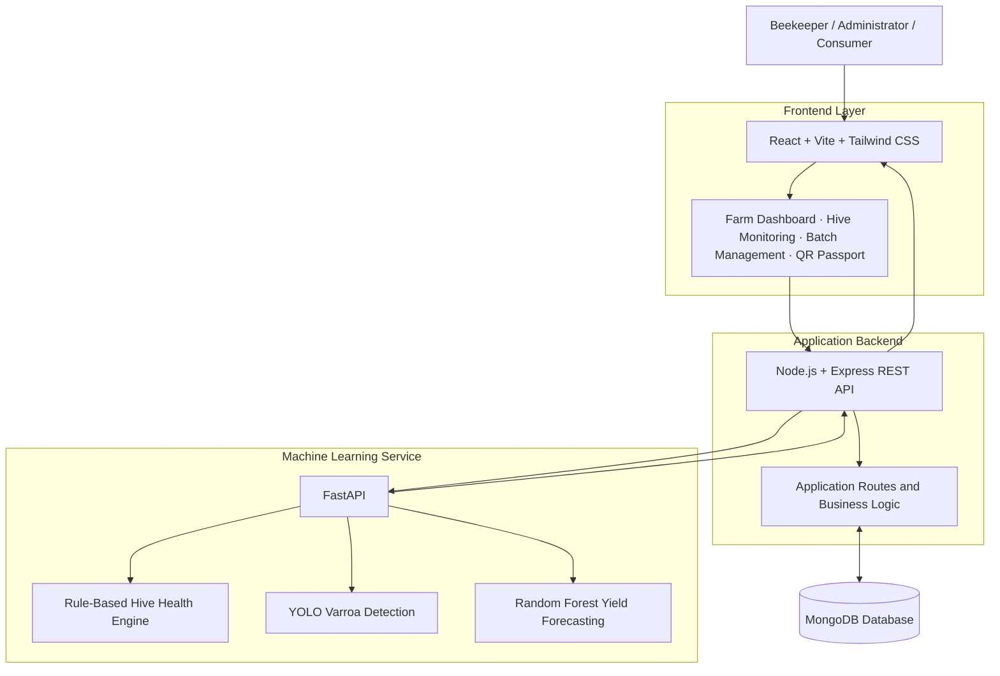
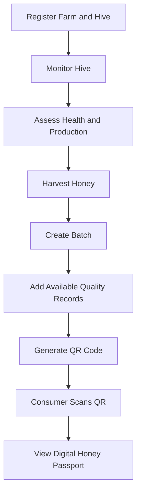

<div align="center">

# 🍯 Honey Chain
### Blockchain-Inspired Honey Traceability & Smart Beekeeping Management System

**From hive to honey jar — transparent, traceable, and data-driven.**

A smart beekeeping and honey traceability platform combining computer vision, machine learning, QR-based digital honey passports, and hive management to improve transparency, support beekeepers, and strengthen consumer trust.

<br/>

[](https://honey-chain-project-82lu.vercel.app/)
[](https://github.com/codePIP404/honey_chain_project)
[](https://youtu.be/Aoa2Drj_07)

</div>

---

## 📌 Table of Contents

- [Overview](#-overview)
- [Problem Statement](#-problem-statement)
- [Our Solution](#-our-solution)
- [Key Features](#-key-features)
- [Live Deployment](#-live-deployment)
- [System Architecture](#-system-architecture)
- [Technology Stack](#-technology-stack)
- [Machine Learning Components](#-machine-learning-components)
- [Honey Traceability Workflow](#-honey-traceability-workflow)
- [API Documentation](#-api-documentation)
- [Getting Started](#-getting-started)
- [Environment Variables](#-environment-variables)
- [Project Structure](#-project-structure)
- [Testing the Application](#-testing-the-application)
- [Model Evaluation](#-model-evaluation)
- [Security and Data Integrity](#-security-and-data-integrity)
- [Current Limitations](#-current-limitations)
- [Future Roadmap](#-future-roadmap)
- [Team](#-team)
- [Acknowledgements](#-acknowledgements)
- [License](#-license)

---

## 🌍 Overview

Honey Chain is a technology-driven platform designed to improve honey traceability and beekeeping management.

Honey production involves multiple stages, including hive management, honey extraction, quality assessment, processing, packaging, and distribution. However, limited visibility across these stages can make it difficult for consumers to verify a product's origin and for beekeepers to manage colony health and productivity.

Honey Chain connects these activities through a unified digital platform.

The system provides:

- Digital farm and hive management.
- Sensor-data-based hive health assessment.
- AI-assisted Varroa mite detection from images.
- Machine learning-based honey yield forecasting.
- Honey batch creation and QR-code generation.
- Digital honey passports for consumers.
- Administrative and beekeeping management interfaces.

The project is developed as a prototype demonstrating how machine learning, digital traceability, and smart beekeeping workflows can work together.

> **Project status:** Deployed academic/hackathon prototype. The current implementation uses a database-backed traceability workflow and QR-linked digital passports. It does not claim to implement a production blockchain network or live IoT infrastructure.

---

## 🎯 Problem Statement

The project addresses challenges faced by beekeepers, honey producers, and consumers.

| Challenge | Impact |
|---|---|
| Limited honey origin transparency | Consumers may struggle to verify where honey originated. |
| Weak traceability across production stages | Connecting a packaged product to its farm, hive, and harvest records can be difficult. |
| Delayed identification of colony health issues | Beekeepers may not identify potential problems early enough. |
| Varroa mite infestation | Varroa mites can negatively affect honeybee colony health and productivity. |
| Uncertain honey production | Honey yield varies with environmental conditions and colony status. |
| Fragmented management systems | Farm, hive, inspection, and harvest records may be maintained separately. |

### Our objective

To develop an integrated digital system that supports:

1. Transparent honey batch records.
2. Digital verification of honey product information.
3. Data-assisted hive monitoring.
4. AI-assisted pest detection.
5. Predictive insights for honey production.
6. Accessible management tools for beekeepers and administrators.

---

## 💡 Our Solution

Honey Chain provides a connected workflow that brings together beekeeping management, machine learning, and product traceability.

<div align="center">

**Farm & Hive Management**  
↓  
**Hive Monitoring & Health Assessment**  
↓  
**Varroa Detection & Yield Forecasting**  
↓  
**Honey Harvest & Batch Creation**  
↓  
**Quality Information & QR Generation**  
↓  
**Consumer Scans QR Code**  
↓  
**Digital Honey Passport**

</div>

Each stage contributes information to the overall honey production record.

The platform is designed to demonstrate how a consumer-facing QR code can connect a honey product with its associated digital records, while giving beekeepers tools to manage their operations.

---

## ✨ Key Features

### 1. 🐝 Farm and Hive Management

Manage beekeeping operations through a centralized interface.

Features include:

- Farm and apiary management.
- Hive registration and identification.
- Hive-level records and monitoring information.
- Environmental sensor-data simulation.
- Centralized access to hive-related information.

The management interface is designed to help users organize hive data and access monitoring and production features.

### 2. 🩺 Hive Health Assessment

The hive health module evaluates environmental and colony-related inputs to generate a health assessment.

Features include:

- Rule-based hive health assessment.
- Environmental parameter analysis.
- Explainable health indicators.
- Health status and recommendations based on configured rules.
- Integration with the hive monitoring interface.

**Implementation note:** The current hive health engine is rule-based. It is not a trained machine learning classifier, and its output should be treated as decision support rather than a veterinary diagnosis.

### 3. 🔬 AI-Powered Varroa Mite Detection

Honey Chain integrates a YOLO-based computer vision model to detect Varroa mites in uploaded images.

<details>
<summary><strong>Varroa detection capabilities</strong></summary>

- Accepts images for model inference.
- Detects visible Varroa mite instances.
- Returns detected bounding boxes and confidence information.
- Supports visualization of detection results.
- Integrates with the FastAPI machine learning service.

The current model is intended to assist with identifying visible mites in images. Its performance depends on image quality, lighting, mite visibility, image scale, and the similarity between real-world images and the evaluation data.

It should not be interpreted as a complete diagnostic system for an entire bee colony.

</details>

### 4. 📈 Honey Yield Forecasting

The platform integrates a Random Forest-based honey yield forecasting pipeline.

The forecasting module uses historical hive and environmental observations to estimate future honey production.

Features include:

- Historical data-based forecasting.
- Environmental and hive-related input processing.
- Integration through the FastAPI prediction service.
- Forecast results accessible from the application.

The current yield prediction pipeline requires a history of at least 15 days of observations.

For the configured input format, the model expects seven days of data with 144 observations per day, giving a total of 1,008 observations.

Forecasts are estimates and should not be treated as guaranteed production quantities.

### 5. 📦 Honey Batch Creation

Create digital records for honey production batches.

A batch can be associated with relevant farm, hive, harvest, and quality information.

Features include:

- Honey batch registration.
- Batch identification.
- Storage of production-related records.
- Association of batches with QR codes.
- Access to batch information through the traceability workflow.

This feature establishes the connection between beekeeping operations and the consumer-facing product passport.

### 6. 🧪 Quality and Lab Workflow

The platform includes a simulated quality assessment workflow to demonstrate how honey quality information can be associated with a batch.

Features include:

- Lab workflow representation.
- Storage of quality-related information.
- Association of quality records with honey batches.
- Display of relevant information through the digital passport.

**Important:** The current workflow does not independently perform physical laboratory tests. Quality information must be supplied or entered into the system; simulated lab records are not equivalent to verified laboratory certification.

### 7. 📱 QR Code and Digital Honey Passport

Every supported honey batch can be linked to a QR code.

Consumers can scan the QR code to access the associated digital honey passport.

The passport is designed to display relevant product information, including:

- Batch identification.
- Honey origin and farm-related information.
- Harvest and production records.
- Available quality information.
- Traceability information associated with the batch.

This enables a consumer-facing verification experience without requiring users to navigate the beekeeper's management dashboard.

### 8. 🏛️ Administrative and KVIC-Oriented Dashboard

The project includes administrative interfaces intended to demonstrate how an organization can oversee beekeeping operations and associated records.

The administrative workflow supports access to relevant farm, hive, and traceability information.

The design is intended to demonstrate how a digital platform could support beekeeping initiatives and organized honey production.

---

## 🌐 Live Deployment

The following services are deployed and can be accessed independently.

| Component | URL |
|---|---|
| Frontend Application | [Open Honey Chain](https://honey-chain-project-82lu.vercel.app/) |
| GitHub Repository | [View Source Code](https://github.com/codePIP404/honey_chain_project) |
| Backend API | [Open Backend](https://honey-chain-project-dm1t.onrender.com/) |
| ML Service | [Open ML Service](https://honey-chain-project-npw5.onrender.com/) |
| ML API Documentation | [Swagger UI](https://honey-chain-project-npw5.onrender.com/docs) |
| Project Demonstration | [Watch on YouTube](https://youtu.be/Aoa2Drj_07) |

> Hosted services may take time to start after periods of inactivity, depending on the deployment configuration and hosting provider.

---

## 🏗️ System Architecture

Honey Chain follows a modular architecture that separates the frontend, application backend, database, and machine learning services.



### Architecture components

| Layer | Responsibility |
|---|---|
| Frontend | User interface, dashboards, forms, batch workflows, and QR passport views. |
| Backend | Application APIs, business logic, data handling, and integration with the ML service. |
| Database | Storage of application records, including relevant farm, hive, and batch information. |
| ML service | Hive health assessment, Varroa image inference, and yield forecasting. |
| QR passport | Consumer-facing access to the digital information associated with a honey batch. |

### Design considerations

- The frontend and backend are maintained as separate application components.
- ML inference is separated from the main application backend.
- The ML service exposes HTTP APIs through FastAPI.
- MongoDB is used for application data storage.
- QR codes connect batch records to the consumer-facing traceability interface.

The current architecture demonstrates a modular prototype. A production deployment would require additional infrastructure, security controls, monitoring, and data-integrity mechanisms.

---

## 🛠️ Technology Stack

<details open>
<summary><strong>Frontend</strong></summary>

| Technology | Purpose |
|---|---|
| React | Component-based user interface |
| Vite | Development server and build tooling |
| Tailwind CSS | Styling and responsive layouts |
| JavaScript | Frontend application logic |
| REST APIs | Communication with backend and ML services |

</details>

<details open>
<summary><strong>Backend and Database</strong></summary>

| Technology | Purpose |
|---|---|
| Node.js | JavaScript runtime |
| Express.js | Backend API framework |
| MongoDB | Application data storage |
| REST API | Application communication |

</details>

<details open>
<summary><strong>Machine Learning and Computer Vision</strong></summary>

| Technology | Purpose |
|---|---|
| Python | ML service and inference logic |
| FastAPI | ML API framework |
| YOLO | Varroa mite object detection |
| Random Forest | Honey yield forecasting |
| Scikit-learn | ML pipeline and model processing |
| PyTorch / Ultralytics | Deep learning inference |

</details>

<details open>
<summary><strong>Deployment and Integration</strong></summary>

| Technology | Purpose |
|---|---|
| Vercel | Frontend deployment |
| Render | Backend and ML service hosting |
| GitHub | Source control and collaboration |
| QR Code | Product identification and digital passport access |

</details>

---

## 🤖 Machine Learning Components

Honey Chain integrates two ML models and one rule-based assessment engine.

### Model 1: Varroa Mite Detection

<badge color="success">Computer Vision</badge> <badge>YOLO</badge>

The Varroa detection model identifies visible mite instances in submitted images.

**Model location in the project:**

`ml_service/models/best.pt`

**Inference endpoint:**

`POST /predict/varroa`

The model returns detection information that can be used by the frontend to present detected mites and their confidence values.

The model is intended for image-based assistance and does not establish the overall infestation level of a colony from a single image.

### Model 2: Honey Yield Forecasting

<badge color="success">Regression / Forecasting</badge> <badge>Random Forest</badge>

The honey yield pipeline estimates production from historical hive and environmental observations.

**Model location:**

`ml_service/models/BeeHave_Environmental_Pipeline.pkl`

**Inference endpoint:**

`POST /predict/yield`

The input data must follow the feature structure and observation requirements expected by the trained pipeline.

For the current configured workflow:

- Minimum historical duration: 15 days.
- Forecast input format: seven days of observations.
- Expected observations: 144 per day.
- Total expected observations for the seven-day format: 1,008.

The pipeline's preprocessing and feature ordering must be preserved when making predictions.

### Model 3: Hive Health Assessment

<badge color="info">Rule-Based Engine</badge>

The hive health module evaluates configured conditions from the supplied hive and environmental data.

**Implementation location:**

`ml_service/app/health_engine.py`

**Inference endpoint:**

`POST /predict/health`

This module is not a trained ML model. Its output depends on the assessment rules and the quality of the supplied inputs.

The purpose is to provide interpretable health indicators and support beekeeper decision-making.

---

## 🔄 Honey Traceability Workflow

The traceability workflow connects honey production records with a consumer-accessible digital passport.

### Step 1: Register a Farm and Hive

The beekeeper registers the farm and associated hive information through the management dashboard.

The records provide the foundation for subsequent monitoring and harvest information.

### Step 2: Monitor Hive Conditions

Environmental or simulated sensor observations are associated with hive records.

The health engine can process supported inputs to generate a rule-based health assessment.

### Step 3: Assess Colony and Production Information

The beekeeper can use the Varroa detection and yield forecasting modules to obtain additional information about mite visibility and estimated honey production.

These predictions are intended to supplement, not replace, practical hive inspections.

### Step 4: Create a Honey Batch

Following harvest, a batch is created in the application.

The batch record can be associated with relevant farm, hive, harvest, and quality information.

### Step 5: Add Quality Information

The prototype allows quality-related information to be associated with a batch through the simulated lab workflow.

Actual laboratory verification requires testing by an appropriate laboratory and accurate recording of the results.

### Step 6: Generate a QR Code

A QR code is generated and associated with the batch or its digital passport URL.

The QR code serves as a convenient access point for the batch's available records.

### Step 7: Consumer Verification

The consumer scans the QR code using a mobile device.

The linked digital honey passport displays the information recorded for that batch.



**Traceability note:** The current prototype stores traceability records using MongoDB and QR-linked application pages. It does not currently provide decentralized consensus, on-chain transactions, smart-contract execution, or independently tamper-proof blockchain records.

---

## 🔌 API Documentation

The machine learning service is built with FastAPI.

### Base URLs

| Service | Base URL |
|---|---|
| Backend | `https://honey-chain-project-dm1t.onrender.com` |
| ML Service | `https://honey-chain-project-npw5.onrender.com` |

### Interactive API Documentation

Use the deployed Swagger interface to inspect endpoints, request schemas, and available API operations:

**[Open ML Service Swagger UI](https://honey-chain-project-npw5.onrender.com/docs)**

### ML Endpoints

| Method | Endpoint | Description |
|---|---|---|
| POST | `/predict/health` | Performs rule-based hive health assessment. |
| POST | `/predict/varroa` | Performs Varroa mite detection on an image. |
| POST | `/predict/yield` | Generates a honey yield prediction from historical observations. |
| GET | `/health/varroa` | Checks the Varroa model service status. |

### Check ML Service Status

```bash
curl https://honey-chain-project-npw5.onrender.com/health/varroa
```

The response indicates whether the Varroa model is loaded and provides the service's available status information.

### Varroa Detection Request

The Varroa endpoint accepts image input. The exact request format depends on the deployed FastAPI schema.

For the deployed service, use the Swagger UI to upload an image and execute the request:

[Open `/predict/varroa` documentation](https://honey-chain-project-npw5.onrender.com/docs)

The response contains detection information such as predicted classes, confidence values, and bounding boxes, depending on the configured endpoint response.

### Hive Health Request

```bash
curl -X POST \
  "https://honey-chain-project-npw5.onrender.com/predict/health" \
  -H "Content-Type: application/json" \
  -d '{
    "temperature": 34.5,
    "humidity": 65
  }'
```

**Note:** This is an illustrative request format, not a guaranteed complete schema. Use the deployed Swagger documentation for the exact required fields and expected JSON structure.

### Honey Yield Request

The yield endpoint accepts historical hive observations in the format required by the configured model.

```bash
curl -X POST \
  "https://honey-chain-project-npw5.onrender.com/predict/yield" \
  -H "Content-Type: application/json" \
  -d '{
    "history": []
  }'
```

The empty history above is a placeholder only and will not produce a valid prediction. Supply the required historical observations and all required features according to the deployed API schema.

---

## 🚀 Getting Started

Follow these steps to run the project locally.

### Prerequisites

Install the following software before starting:

- Node.js and npm.
- Python 3.10 or another version compatible with the ML dependencies.
- Git.
- MongoDB local installation or a MongoDB Atlas connection.
- A compatible Python environment for the trained ML models.

### 1. Clone the Repository

```bash
git clone https://github.com/codePIP404/honey_chain_project.git

cd honey_chain_project
```

### 2. Inspect the Project Structure

The repository contains the frontend, backend, and ML service components.

Check the project directories and locate the relevant package and requirements files before installing dependencies.

### 3. Configure the Backend

Navigate to the backend directory. The exact directory name should match the current repository structure.

```bash
cd backend
```

Install dependencies:

```bash
npm install
```

Create a `.env` file using the variables required by the backend configuration.

For example:

```env
PORT=5000
MONGODB_URI=your_mongodb_connection_string
```

Add any additional environment variables required by the backend, such as the ML service URL or authentication configuration.

Start the backend using the start script defined in its `package.json`:

```bash
npm start
```

If the project uses a development script, use:

```bash
npm run dev
```

Return to the repository root before proceeding.

### 4. Configure the ML Service

Navigate to the ML service directory:

```bash
cd ml_service
```

Create a Python virtual environment:

```bash
python -m venv venv
```

Activate the environment.

**Windows:**

```bash
venv\Scripts\activate
```

**Linux / macOS:**

```bash
source venv/bin/activate
```

Install the dependencies specified in the ML service requirements file:

```bash
pip install -r requirements.txt
```

Verify that the model files required by the application are present:

```text
ml_service/
├── models/
│   ├── best.pt
│   └── BeeHave_Environmental_Pipeline.pkl
└── app/
    └── health_engine.py
```

Start the FastAPI application using the actual Python entry point configured in the repository.

For example, if the application instance is named `app` in `main.py`:

```bash
uvicorn main:app --host 0.0.0.0 --port 8000
```

If the entry point is in a package or a different file, adjust the command accordingly.

The interactive documentation should then be available at:

`http://localhost:8000/docs`

Return to the repository root before starting the frontend.

### 5. Configure the Frontend

Navigate to the frontend directory:

```bash
cd frontend
```

Install the dependencies:

```bash
npm install
```

Configure the frontend API base URLs using the environment variable names expected by the application.

For a Vite application, the configuration may use variables such as:

```env
VITE_API_URL=http://localhost:5000
VITE_ML_API_URL=http://localhost:8000
```

These names are examples; use the exact variable names referenced in the frontend source code.

Start the development server:

```bash
npm run dev
```

Vite will display the local development URL in the terminal.

Open that URL in your browser to access Honey Chain.

---

## ⚙️ Environment Variables

The following table illustrates the configuration values commonly required for the application. Verify the exact names in the current repository before deploying.

| Variable | Component | Description |
|---|---|---|
| `PORT` | Backend | Port on which the backend listens. |
| `MONGODB_URI` | Backend | MongoDB connection string. |
| `VITE_API_URL` | Frontend | Backend API base URL, if used by the frontend. |
| `VITE_ML_API_URL` | Frontend | ML service URL, if called directly by the frontend. |

### Configuration Notes

- Do not commit `.env` files containing credentials or private keys.
- Keep database connection strings and secret keys on the server.
- Use HTTPS for deployed API communication.
- Ensure frontend CORS and backend API configuration allow the intended deployment origins.
- Do not expose server-side secrets through Vite environment variables.

---

## 📁 Project Structure

The following is a logical overview of the project's main components. Individual directory names and additional files may vary depending on the current repository version.

```text
honey_chain_project/
│
├── frontend/
│   ├── src/
│   │   ├── components/
│   │   ├── pages/
│   │   ├── assets/
│   │   └── ...
│   ├── public/
│   ├── package.json
│   └── ...
│
├── backend/
│   ├── routes/
│   ├── controllers/
│   ├── models/
│   ├── package.json
│   └── ...
│
├── ml_service/
│   ├── app/
│   │   └── health_engine.py
│   ├── models/
│   │   ├── best.pt
│   │   └── BeeHave_Environmental_Pipeline.pkl
│   ├── requirements.txt
│   └── ...
│
├── assets/
│   └── ...
│
└── README.md
```

### Main Components

| Component | Responsibility |
|---|---|
| `frontend/` | User interface, dashboards, and consumer-facing pages. |
| `backend/` | Application routes, business logic, and database interaction. |
| `ml_service/` | Model inference, health assessment, and prediction APIs. |
| `ml_service/models/` | Model artifacts used by the inference service. |
| `assets/` | Project screenshots and other documentation assets. |

---

## 🧪 Testing the Application

The following workflow can be used to demonstrate the main features of Honey Chain.

### End-to-End Demo Checklist

- [ ] Open the live application.
- [ ] Navigate through the landing page and management dashboard.
- [ ] Register or select a farm.
- [ ] View or register a hive.
- [ ] Access hive monitoring and health assessment.
- [ ] Submit an image to the Varroa detection service.
- [ ] View a honey yield forecast using valid historical observations.
- [ ] Create a honey batch.
- [ ] Add the available quality information.
- [ ] Generate the batch QR code.
- [ ] Open the QR-linked digital honey passport.
- [ ] Verify the batch information displayed to the consumer.

### ML Service Testing

Use the deployed Swagger documentation to test the ML endpoints independently.

[Open the ML API test interface](https://honey-chain-project-npw5.onrender.com/docs)

For local testing, start the FastAPI service and use:

`http://localhost:8000/docs`

Use valid model inputs and the schemas exposed by the running service.

### Suggested Test Scenarios

| Test | Expected behavior |
|---|---|
| Valid Varroa image | The service processes the image and returns detection results. |
| Invalid image input | The service should return an appropriate validation or error response. |
| Valid health input | The rule-based engine returns an assessment according to its configured rules. |
| Insufficient yield history | The service should reject or handle the request according to its input validation. |
| Valid yield history | The yield pipeline processes the observations and returns a prediction. |
| Valid batch QR code | The QR code opens the associated passport or batch page. |

These are intended test scenarios, not claims that automated tests have already been executed for every case.

---

## 📊 Model Evaluation

The following metrics were reported for the Varroa detection model in the project's development results.

### Varroa Detection Results

| Metric | Reported value |
|---|---:|
| Precision | 0.8056 |
| Recall | 0.8030 |
| mAP@50 | 0.8357 |
| mAP@50–95 | 0.3134 |

The reported mAP@50 is approximately 83.57%, while mAP@50–95 is approximately 31.34%.

These are the previously reported evaluation results for the model, not independently verified benchmarks in this README.

For reproducible evaluation, the project should document:

- Dataset source and version.
- Number of training, validation, and test images.
- Annotation format and class definitions.
- Train/validation/test split methodology.
- Model architecture and training configuration.
- Evaluation software and metric definitions.

### Evaluation Considerations

Object detection performance can vary based on:

- Image resolution and camera quality.
- Lighting, blur, and image compression.
- Mite size and visibility.
- Crowding and overlapping bees.
- Differences between training images and real-world photographs.

In particular, a high mAP@50 does not guarantee reliable mite detection in every real-world hive image. Testing with independent field images is necessary before making claims about real-world diagnostic performance.

No independently verified yield forecasting accuracy or hive health classification accuracy is claimed here.

---

## 🔐 Security and Data Integrity

Honey Chain is an academic and hackathon prototype. The following considerations are important for further development.

### Application Security

- Store sensitive credentials in environment variables.
- Use appropriate authentication and authorization for administrative operations.
- Restrict access to management and administrative endpoints.
- Validate user input on both the frontend and backend.
- Configure CORS to allow only intended origins.
- Avoid exposing internal database or server error details to public users.

### Data Integrity

The current database-backed implementation associates batches with stored application records.

A production traceability system should additionally consider:

- Immutable audit logs.
- Authentication of data contributors.
- Digital signatures for critical records.
- Verification of laboratory certificates.
- Controlled updates to batch records.
- Secure identity and access management.

QR codes provide convenient access to digital records, but a QR code alone does not establish that the underlying data is authentic or tamper-proof.

A future blockchain integration could introduce verifiable records and transaction history, subject to an appropriate network and smart-contract design.

---

## ⚠️ Current Limitations

The following limitations are important when interpreting the current prototype.

| Area | Current implementation / limitation |
|---|---|
| Blockchain | Database-backed traceability; no production blockchain consensus or smart-contract implementation is claimed. |
| IoT | Sensor inputs and monitoring workflows include simulated data; live hardware integration is not claimed. |
| Hive health | Uses a rule-based assessment engine rather than a trained ML diagnostic model. |
| Varroa detection | Image-based detection; performance depends on visibility, image quality, and evaluation data. |
| Honey yield | Forecasts depend on historical observations and the trained model's feature requirements. |
| Lab verification | The lab workflow is simulated; it does not independently conduct physical tests. |
| Product authenticity | QR-linked records provide traceability information but do not independently certify the authenticity or purity of honey. |
| Production readiness | Further security hardening, field validation, monitoring, and operational testing are required. |

The project demonstrates a working prototype of the proposed workflows. Actual deployment in commercial beekeeping operations would require field testing, validated datasets, reliable hardware integrations, and appropriate operational controls.

---

## 🛣️ Future Roadmap

The following are proposed enhancements and are not represented as completed features.

### Phase 1 — Smart Beekeeping

- [ ] Integrate live temperature, humidity, and hive-weight sensors.
- [ ] Add real-time monitoring and alerting.
- [ ] Improve colony health indicators with field-validated data.
- [ ] Expand Varroa detection evaluation using diverse real-world images.

### Phase 2 — Predictive Intelligence

- [ ] Evaluate alternative forecasting algorithms.
- [ ] Improve prediction accuracy through additional validated datasets.
- [ ] Add uncertainty estimates and prediction intervals.
- [ ] Develop explainable hive and production analytics.

### Phase 3 — Verifiable Traceability

- [ ] Design a blockchain-based record architecture.
- [ ] Evaluate smart contracts for batch lifecycle records.
- [ ] Add cryptographic verification of critical records.
- [ ] Integrate verified laboratory certificates.
- [ ] Explore interoperable traceability standards.

### Phase 4 — Production Deployment

- [ ] Add comprehensive automated backend and frontend tests.
- [ ] Introduce monitoring and structured logging.
- [ ] Improve role-based access control.
- [ ] Conduct security and performance testing.
- [ ] Evaluate field deployment with beekeepers and relevant stakeholders.

---

## 👥 Team

Honey Chain was developed as a collaborative project.

| Name |
| Manish Shaw |
| Bikash Pradhan |
| Sandip Sen |
| Tirthes Samantha |
| Sovan Kar |
| Salmali Chattopadhyay |

### Project Links

- **GitHub:** [codePIP404/honey_chain_project](https://github.com/codePIP404/honey_chain_project)
- **Live Application:** [Honey Chain](https://honey-chain-project-82lu.vercel.app/)
- **Demo Video:** [Watch the project demonstration](https://youtu.be/Aoa2Drj_07)

---

## 🙏 Acknowledgements

We acknowledge the open-source communities and tools that made this project possible, including the developers and maintainers of React, Vite, Tailwind CSS, Node.js, Express, MongoDB, FastAPI, Ultralytics, PyTorch, and Scikit-learn.

We also acknowledge the researchers and dataset providers whose work supports the development of data-driven beekeeping and honey production systems.

Dataset sources and model-specific references should be cited alongside the relevant training and evaluation documentation as the project evolves.

---

## 📄 License

The project license has not been specified in this README.

Before distributing or reusing the source code, add a `LICENSE` file to the repository and replace this section with the actual license name and terms.

For example, if the team chooses the MIT License, include the official MIT license text and update this section accordingly. Do not assume the project is MIT-licensed unless the repository explicitly includes that license.

---

<div align="center">

### 🍯 Honey Chain

**Connecting beekeepers, technology, and consumers through digital traceability.**

[Live Demo](https://honey-chain-project-82lu.vercel.app/) · [GitHub](https://github.com/codePIP404/honey_chain_project) · [YouTube Demo](https://youtu.be/Aoa2Drj_07)

</div>
